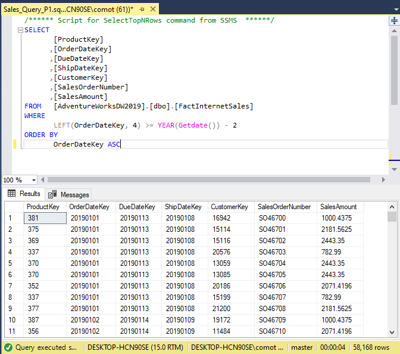

# SALES OVERVIEW 
### Project overview

### Objectives:
The goal is to build a sales report that shows summarized information about the business´s current situation. The more important indicators are sales, budget, top costumers, and top products:

**Deliverables:**

| Demanding | Value | Deliverable |
| ----------- | ----------- | ----------|
| A dashboard that summarizes the internet sales current situation | To understand which products and customers have the biggest impact on the company | A dashboard that shows the most important metrics and that can be updated everyday |
| An overview of sales organized by clients | To acknowledge which customers, buy more and how to sell more to them | A dashboard that can filter customers by product, city, and relevance  |
| A detailed overview of the best products | To follow those products that have better sales | A dashboard that can filter products by customer, city, and relevance |

### Data transformation and data preparation
The data was taken from the Microsoft sample data and was extracted using SQL server into csv files to use them in the Power BI dashboard.

Date_table was used to retrieve dates about the performances of the sales through time

Sales_table, product_table and customer_table show information about sales, products and customers in that order

You can see all the SQL queries **[HERE](https://github.com/Roberto121c/Sales_Management/tree/main/Query)**:

### Data model:
You can see in this image the data model used in Power BI after the data was extracted

### Visualizations 
The final product is a 3 pages dashboard. The first one tell us a general perspective about the sales performance while other two focus in customers and products

You can see the final dashboard clicking **[HERE](https://app.powerbi.com/groups/me/reports/38779509-37e6-43d9-b1cd-b209b48d75cf/ReportSection)** or in the image below

### Conclusions
